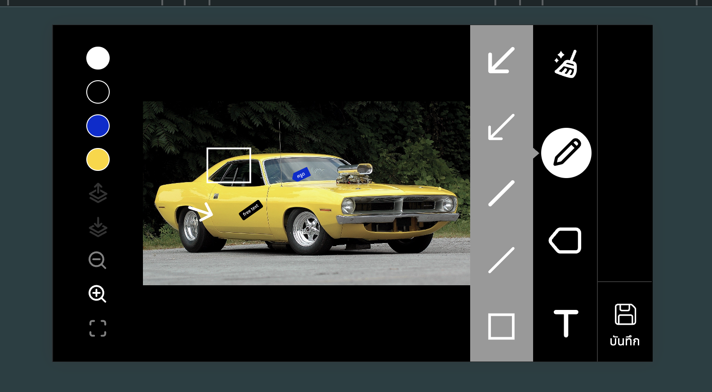

#### This project is an image editor built with Angular and Fabric.js, designed to provide a smooth editing experience across both desktop and mobile platforms. The editor supports common shape drawing, adding tags, freehand text, and managing layers, with zoom and layer manipulation features.

## Desktop


## Mobile



## Features

- Common Shapes: Draw basic shapes such as rectangles, circles, and lines.
- Tags: Add customizable tags to images for annotations or labels.
- Free Text: Insert and style free text on your images.
- Zoom In/Out: Easily zoom in and out to edit your image in detail.
- Layer Management: Move layers to the top or send them to the back.
- Clear all layers with a single click.
- Local Storage: Save your edited image and data in local storage.
- Cross-Platform Compatibility: Works seamlessly on both desktop and mobile devices.

# AngularFabricJs

This project was generated with [Angular CLI](https://github.com/angular/angular-cli) version 18.0.3.

# Getting Started

Clone this repository and follow the installation instructions to get the Angular image editor up and running.

```bash
git clone https://github.com/niawjunior/angular-image-editor.git
cd angular-image-editor
npm install
ng serve
```
